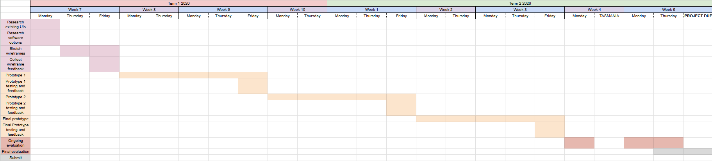

# UX Design Project - 10CT TASK 1
# Project Proposal
For this project, I’ve selected the fantasy novel ‘Set Fire to the Gods’ by Sara Raasch and Kristen Simmons, set in a Greco-Roman inspired world and centring around two warriors. I chose this book specifically due to its invigorating fantasy elements and clear, well-drawn world map - I thought of doing a map before choosing a book, so the world building was very appealing. The software I’ll be designing alongside it is an interactive world map, in which the user can hover over each area for a basic amount of information, and click on different boxes within that to see detailed information on characters, setting, and backstory. This user experience type has a focus on aesthetics (especially with animation and the stylistic map), and this will work especially well to engage the user in the fantasy world. This program is great for people interested in reading ‘Set Fire to the Gods’, but also for those who’ve read it and want more information they may have missed. More specifically, the target audience is young adults (14-18 year olds), who likely have a prior interest in the fantasy genre. For this task, I’ll first be experimenting with Unity - if that doesn’t perform as I’d like, I’ll instead be using Powerpoint.
# Identifying and Defining
## Functional Requirements
### Purpose of the Application
- The app will allow users to interact with ‘Set Fire to the Gods’’s world map, hovering over areas for popups which also allow for further interaction. The users should be able to see a basic summary of the selected area, information about characters from that area, and notes about the backstory of it. The application is great both for people already familiar with the book, as well as people interested in getting into it, or just generally knowing more about it.
### User Requirements
- The user should be able to:
    - Hover over locations on the map to view simple summaries
    - Click on buttons within that pop-up to get more information
### Inputs and Outputs
- **INPUTS**:
    - Hovering over the map
    - Clicking within the pop-up
- **OUTPUTS**:
    - Information being displayed (location summary)
    - Information being displayed (characters, backstory, etc.)
### Core Features
- The system must inform users about the novel, giving them the choice of what information to display when. This interactivity will immerse users in the novel.
### User Interaction
- The user will interact with the system through a graphical interface, created in Unity (possibly Powerpoint).
### Use Cases & Test Cases
1. User will hover over a location on the map to view the pop-up
    - Actors: User
    - Preconditions: Code and scene are fully functional
    1. User hovers their cursor over a location
    2. The pop-up shows up
    3. The user can move their mouse away from the location/pop-up to exit
    - Postconditions: Information has been displayed successfully
    - Testing: Can be tested through self-testing / unit-testing, however, it will also be important to ensure hovering works on multiple devices
2. User will click on a character in the pop-up for more information
    - Actors: User
    - Preconditions: Code and scene are fully functional
    1. User clicks on a character within the popup
    2. The user is taken to a different page/scene which displays more information
    3. The user can interact with elements within that page
    4. The user can press the back button to return to the home page
    - Postconditions: The user has been taken to a different page and is able to return
    - Testing: Self-testing is adequate
3. User will click on the location for more information
    - Actors: User
    - Preconditions: Code and scene are fully functional
    1. User clicks on a location rather than hovering
    2. The user is taken to a different page/scene which displays more information
    3. The user can interact with elements within that page
    4. The user can press the back button to return to the home page
    - Postconditions: The user has been taken to a different page and is able to return
    - Testing: Self-testing is adequate
4. User will click the back button to return to the homescreen
    - Actors: User
    - Preconditions: Code and scene are fully functional; user is already within either a character page or a location page
    1. User clicks on the back button
    2. The user is taken back to the home page
    - Postconditions: The user has been taken back to the home page
    - Testing: Self-testing is adequate

## Non-Functional Requirements
### Performance
- Navigation between screens should occur within one second - a loading screen shouldn't be required.
### Usability
- Hovering over a location should be slightly delayed to ensure there isn't overlap and accidental hovering.
- The layout of each popup should be consistent.
- There should be a clear help and back button for ease of navigation.
- There should be a balance between using fonts for display reasons whilst still being accessible and readable.
### Reliability
- The application should be tested on multiple devices (laptop, PC, and possibly mobile - mobile isn't required.) Unity has built-in features for testing the application on different screen sizes.
### Security
- There shouldn't be any issues with security due to the application only being used locally.

## Social, Ethical, and Legal Issues
### Social Impact
- Target Audience:
    - The application should be accessbile for people of all ages and abilities. The specific target audience is those aged 14-18, and with a reasonably high reading ability, but this doesn't change the fact that the application should be simple, legible, and usable for all.
- Potential Benefits:
    - The aesthetic side of the application specifically aims to encourage people to read more, or start reading this specific book, through the way it invests users in the fantasy genre. It'll also help to promote the book further.
- Potential Risks:
    - One includes the acccessibility/legibility being brought down through a focus on aesthetics; gothic fonts may be hard for some people to read. Some themes in the book that may be risky for children include a small amount of coarse language, sexual jokes, and some violence.
### Ethical Responsibilities
- User Data & Privacy
    - The program will not collect any user data.
- Representation & Inclusion
    - The program will present characters fairly, without leaving out any ideas or context due to biases or personal views.
- Content Sensitivity
    - As mentioned in 'potential risks', the content included in the book includes some violence, mildly sexual jokes, and a small amount of coarse language. These will be handled by not including those specific parts in the application, as they aren't really relevant to the backstory of the book or characters.
### Legal Considerations
- Copyright & Intellectual Property:
    - I'll be using the map and ideas featured in the book, which is legal due to the project not being commercial. The author should be credited.
- Terms of Use:
    - 'smartcopying.edu.au' states that copies and communications of novels may be made as long as it's for educational reasons.

# Researching and Planning
## Gantt Chart

Higher resolution here: https://docs.google.com/spreadsheets/d/1d0ylO19h6-PUTPQMZmZG6J8g5euH4P9zzTzN37sQISU/edit?usp=sharing

## Research Existing UIs
| UI name | Plus | Minus | Implication
| ----------- | ----------- | ----------- | -----------
| Netflix | Netflix's UI is iconic, recognisable, smooth, and personal to the user. The onboarding is quick and simple, the home page engages the user immediately, and the personalised algorithm ensures user satisfaction. | Some users have described the user interface as cluttered, making it more complicated and difficult to use (in more recent updates). The recommended movie/show which autoplays has been described as taking up too much space and being irritating (again, due to the autoplaying function). | Netflix is an extremely popular streaming service, largely due to its successful user interface. By limiting autoplaying and a singular element taking up too much space, the UI would be ideal for user experience.
| Google's Search Page | The page loads quickly and is very simple, with pages laid out in a list by relevance, allowing for users to quickly find their desired page. Google's search function works on a huge variety of devices, with the same performance and functionality. | In recent years, Google users have criticised it for introducing new features such as 'AI mode' and the AI overview, with Google making the choice to remove the original overview entirely, for most searches. With many Google users preferring not to use AI due to its inaccuracy and negative impacts, the lack of user customisation in this choice has brought down user experience greatly. | Google is the world's most popular search engine, and its user interface has always been critical to its success. It's maintained its simple and accessible elements since its creation, although, it has recently been critisiseed on a wide scale due to new unwanted features taking up space and removing much-loved features. Communication with users should be improved to ensure user satisfaction.
| Lucidchart | Lucidchart's home page, which I'll be focusing on, has clear information about the site, elements visually describing the product, and a bar at the top with any links the user may need to visit. These enhance its usability. | Lucidchart is generally described as unusable due to its extreme amount of popups and its cluttered homepage. The home page features 3 different popups (two of which are related to their AI chatbot, which serves no purpose), which take up much of the space and overwhelm the user. The animated elements add to the overwhelming aspects as well, and the page doesn't clearly explain its product due to a focus on AI rather than making diagrams. | Lucidchart is a relatively generic website and has garnered some popularity due to the great tools within it. The home page is extremely cluttered and should be reorganised in order to not overwhelm the user, and to pose more focus on their great elements which are overshadowed by AI popups and auto-playing videos.

## Research Software Options
| Software Name | Plus | Minus | Implication
| -------- | -------- | -------- | -----
| Powerpoint | Powerpoint is a very simple tool, with many tutorials across the web on how to use it in various unique ways. It allows for ease of image insertion, navigation between pages, and sharing. | Its simplicity is also where it begins to fail; although it's great for creating elements within pages and navigation between them, it's lacking many features such as creative animation, code for extra customisation, and an ability to add extra features (such as a minigame). | Powerpoint would be a great tool for a very simple prototype of my application; however, its simplicity doesn't allow for much flexibility or creativity, which I require.
| Unity | Unity allows for unlimited freedom, giving the user a software in which they can do just about anything. Although it's primarily used for creating games, making interactive programs is also possible. | The focus on game development may create a struggle for features of my application which are focused moreso on displaying information, rather than gaming. Unity may be overly complicated, which is unnecesary when the application I'm developing is quite simple. The performance also isn't as high as others. | The freedom possible within Unity allows for a great amount of flexibility and creativity when creating the project, however, it may not be ideal due to low speed when switching between pages, and a higher focus on games.
| Adobe XD | Adobe XD is a software more specifically made for interactive websites - similar to the kind of application I'm trying to make. It allows for very easy and fast navigation between pages, something Unity lacks in. | Adobe XD has quite rigid UI, making it more difficult to have flexibility in the design and aesthetics side of my project. There's a lack of features, which although it does enhance simplicity, it, again, restricts freedom. | Adobe XD is very ideal for navigation between pages, which is a key part of my application - however, its lack of features and restriction of user input could lead to an inability to incorporate interesting features.

## Sketch Wireframes